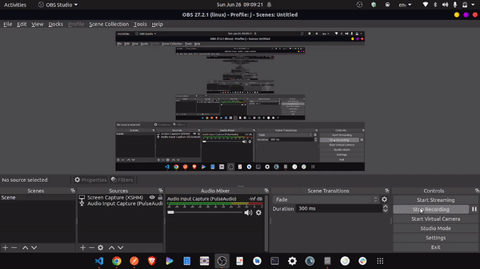

# Video fetcher

## About

API to fetch latest videos of **football** category from YouTube.

## Tech and Apis Used

-   Django
-   YouTube data v3 API
-   Html, Css and Js

## Setup

Step 1: Install the virtualenv package by runninng

```bash
pip install virtualenv
```

Step 2: Create the virtualenv by runninng

```bash
virtualenv -p python3 videos_venv
```

Step 3: Install all packages

```bash
pip install -r /path/to/requirements.txt
```

Step 4: Activate the virtualenv by runninng

```bash
source videos_venv/bin/activate
```

Step 5: Deactivate the virtualenv by simply runninng

```bash
deactivate
```

Step 6: Keep updating the requirements.txt if any new packages are installed by running

```bash
pip freeze > requirements.txt
```

To resume development post new pulls, always run **pip install -r /path/to/requirements.txt** to install the latest requirements.

Step 7: Run Cron Job. [for more details](https://github.com/kraiz/django-crontab)

```bash
python manage.py crontab add
```

Step 8: Run Django Server

```bash
python manage.py runserver
```

## App Functions

1. Provide Api to get latest video of predefined query.
2. Change Api Key Automatic if current key exhausted.
3. Simple Home page to see latest videos.
4. Video Output



## Api Provided

1. Get videos
   url

    ```bash
    videos/<int:page>/<int:per_page_items>
    ```

    Params

    ```bash
    page: page number to get
    per_page_items: number of videos per page
    ```

    Response

    ```json
    {
        "page": {
            "current": "Number-current page number",
            "has_next": "Boolean-if we have next page",
            "has_previous": "Boolean-if we have previous page"
        },
        "data": [
            {
                "id": "Ids",
                "title": "String-Title of video",
                "description": "String -Description of video",
                "video_id": "String",
                "thumbnail": "URL",
                "publish_time": "Time",
                "channel_title": "String- Channel title"
            }
        ]
    }
    ```

    ## Thank You
